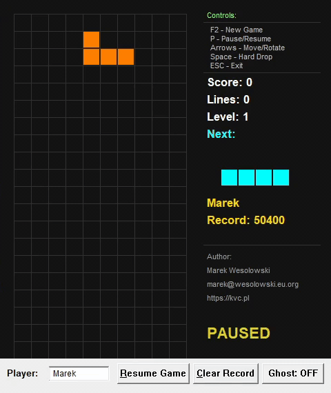

# Tetris-Assembly (x86 & x64)




A high-performance, lightweight Tetris implementation written in pure Assembly (MASM) utilizing the Windows API. The project focuses on minimal binary footprint, efficient memory management, and direct OS integration without C Runtime (CRT) dependency.

Available in two architectures:
- **x86 (32-bit):** ~13 KB binary
- **x64 (64-bit):** ~15 KB binary

**Subsystem:** Windows (GUI)

## 🔗 Quick Links
- **Download Binaries:** [tetris.zip (v1.0.0)](https://github.com/wesmar/Tetris/releases/download/v1.0.0/tetris.zip) - Contains both x86 and x64 versions
- **Source Repository:** [GitHub](https://github.com/wesmar/Tetris)

## 🏗️ Architecture Comparison: x86 vs x64

### Binary & Source Code Metrics
| Metric | x86 (32-bit) | x64 (64-bit) | Notes |
| :--- | :--- | :--- | :--- |
| **Final Binary Size** | ~13 KB | ~15 KB | +15% size increase due to 64-bit pointers and alignment |
| **Source Code Lines** | ~2,400 LOC | ~2,600 LOC | +8% lines for manual calling convention management |
| **Calling Convention** | `stdcall` | Microsoft x64 (`fastcall`) | Fundamental architectural difference |

### Key Technical Differences

#### 1. **Calling Convention Complexity**
The x86 version benefits from the comfortable `stdcall` convention with MASM's `invoke` macro, which abstracts argument passing:
```asm
; x86: Simple and readable
invoke MessageBox, hWnd, addr szMessage, addr szTitle, MB_OK
```

The x64 version requires manual implementation of Microsoft's x64 calling convention (fastcall variant):
```asm
; x64: Manual register loading and stack management
mov rcx, hWnd              ; 1st argument in RCX
lea rdx, szMessage         ; 2nd argument in RDX
lea r8, szTitle            ; 3rd argument in R8
mov r9d, MB_OK             ; 4th argument in R9
sub rsp, 32                ; Shadow space (mandatory 32 bytes)
call MessageBox
add rsp, 32                ; Clean up shadow space
```

#### 2. **Shadow Space Requirement**
x64 mandates 32 bytes (4×8-byte slots) of "shadow space" on the stack for every function call, even if the function takes fewer than 4 parameters. This is a strict ABI requirement for Windows x64 and must be maintained even when not passing arguments via stack.

#### 3. **Stack Alignment**
x64 requires 16-byte stack alignment (`RSP & 0xF == 0`) **before** `call` instructions. Misalignment causes crashes in many API functions (particularly graphics-related). This requires explicit alignment:
```asm
and rsp, -16   ; Align to 16-byte boundary
```

#### 4. **Register Usage**
- **x86:** Arguments pushed on stack (right-to-left), return value in `EAX`
- **x64:** First 4 integer/pointer arguments in `RCX`, `RDX`, `R8`, `R9`; additional arguments on stack; return value in `RAX`

#### 5. **Pointer Size Impact**
All pointers and handles are 64-bit (8 bytes) in x64, affecting:
- Structure sizes and alignment
- Memory access patterns
- Address arithmetic

### Development Challenges: x86 → x64 Migration

The transition from x86 to x64 was a significant undertaking, primarily due to:

1. **Loss of High-Level Abstractions:** The comfortable `invoke` macro in x86 (which auto-generates push sequences) is unavailable in x64. Every API call requires 5-7 lines of manual register/stack management.

2. **Shadow Space Management:** Unlike x86's simple stack cleanup (`add esp, N`), x64's shadow space requirement adds cognitive overhead to every function call. Forgetting to allocate or deallocate shadow space leads to stack corruption.

3. **Stack Alignment Debugging:** Crashes due to misaligned stacks are notoriously difficult to debug. A single misalignment early in the call chain can cause failures deep in GDI/Win32 APIs, far from the actual error.

4. **Increased Code Verbosity:** Simple operations in x86 (1 line with `invoke`) expand to 6+ lines in x64, reducing code readability and increasing maintenance burden.

5. **No `invoke` Safety Net:** The x86 `invoke` macro performs type checking and automatic stack cleanup. x64 requires manual verification of argument types, counts, and calling conventions for every API.

Despite these challenges, the x64 version maintains identical functionality and visual behavior, demonstrating that low-level assembly can achieve platform parity with careful attention to ABI details.

## 🛠 Technical Specifications & Features

### 1. Core Engine
- **Zero-Dependency:** No external libraries beyond standard Windows system DLLs (`user32`, `gdi32`, `kernel32`, `advapi32`, `shell32`).
- **Memory Footprint:** Highly optimized data structures. The entire game state is encapsulated in a single `GAME_STATE` structure.
- **7-Bag Randomizer:** Implements the modern Tetris Guideline "Random Generator" (7-bag) algorithm using Fisher-Yates shuffle. This ensures a uniform distribution of pieces and prevents long droughts of specific shapes by shuffling a "bag" of all 7 tetrominoes.
- **Fixed Timestep:** Game logic is driven by a high-frequency loop tuned for 60 FPS (~16ms delta), ensuring smooth input response and movement.
- **SRS-inspired Rotation:** Super Rotation System with wall kick tables for both standard pieces and I-piece, allowing rotation near walls and floors.

### 2. Graphics & Rendering
- **GDI Double Buffering:** Implementation of a backbuffer system using `CreateCompatibleDC` and `CreateCompatibleBitmap` to eliminate flickering during high-frequency screen invalidation.
- **Ghost Piece Preview:** Toggleable semi-transparent hatch pattern overlay showing the landing position of the current piece, rendered using `CreateHatchBrush` with `HS_DIAGCROSS` pattern.
- **Animated UI Elements:** Pulsing "PAUSED" text with sine-wave brightness modulation (127-255 range) at 60 FPS for smooth visual feedback.
- **Vector-like Tetromino Definition:** Shapes are defined as coordinate offsets in `SHAPE_TEMPLATES`, allowing for efficient rotation and collision calculations via iterative offset addition.
- **Dynamic UI:** Integration of standard Win32 controls (Edit boxes, Buttons) with custom GDI-rendered game area.
- **Color-Coded Interface:** Next piece preview and record holder name displayed in matching piece colors for visual consistency.

### 3. Data Persistence (Registry-based)
Unlike traditional implementations using `.ini` or `.cfg` files, this project utilizes the Windows Registry for state persistence:
- **Path:** `HKEY_CURRENT_USER\Software\Tetris`
- **Stored Keys:**
  - `PlayerName` (REG_SZ / Unicode): Last active player identity.
  - `HighScore` (REG_DWORD): Maximum score achieved.
  - `HighScoreName` (REG_SZ / Unicode): Name of the record holder.
- **Encoding:** Full Unicode support for player names via `RegQueryValueExW` and `RegSetValueExW`.
- **Clear Record Feature:** One-click registry cleanup via Alt+C or dedicated button with confirmation dialog.

### 4. Collision & Logic
- **AABB-style Collision:** Piece-to-wall and piece-to-stack collision detection implemented through boundary checking and bitmask-like array lookups in the 10x20 board buffer.
- **Line Clearing:** Optimized scanline algorithm that identifies full rows and performs a memory-shift operation to drop the remaining blocks. Supports simultaneous multi-line clears.
- **Progressive Difficulty:** Gravity speed increases with level (every 10 lines cleared), calculated using fixed-point arithmetic with 1/10000 precision for smooth acceleration.
- **Scoring System:** Quadratic scaling (lines² × 100 × level) rewards multi-line clears and higher levels.

### 5. User Experience
- **Keyboard Shortcuts:** Full accelerator table support (P/Alt+P, P/Alt+R, Alt+C) for pause, resume, and clear operations.
- **Customizable Icon:** Dynamic icon loading from `shell32.dll` via `ExtractIcon` API (configurable index).
- **Real-time Name Persistence:** Player name auto-saves on text change via `EN_CHANGE` notification.
- **Anonymous Fallback:** Automatically assigns "Anonymous" to high scores when no player name is set.

## 📂 Project Structure

The repository contains separate implementations for both architectures in dedicated directories:

```
Tetris_asm/
├── x86/                  # 32-bit implementation
│   ├── main.asm         # Entry point, WndProc, message loop
│   ├── game.asm         # Core game logic
│   ├── render.asm       # GDI rendering engine
│   ├── registry.asm     # Registry persistence layer
│   ├── data.inc         # Structures and constants
│   └── proto.inc        # Procedure prototypes
├── x64/                  # 64-bit implementation
│   ├── main.asm         # Entry point (manual x64 calling convention)
│   ├── game.asm         # Core logic (64-bit registers)
│   ├── render.asm       # GDI rendering (shadow space management)
│   ├── registry.asm     # Registry operations (64-bit pointers)
│   ├── data.inc         # Structures (8-byte alignment)
│   └── proto.inc        # Procedure prototypes (fastcall)
├── bin/                  # Output directory (created by build script)
│   ├── tetris.exe       # x86 binary (~13 KB)
│   └── tetris64.exe     # x64 binary (~15 KB)
└── build.ps1            # Unified PowerShell build script for both versions
```

### Key Files

| File | Description |
| :--- | :--- |
| `main.asm` | Entry point, Window Procedure (`WndProc`), Message Loop, UI Control handling, and keyboard accelerators. |
| `game.asm` | Core logic: Tetromino movement, rotation with wall kicks, 7-bag generation using LCG RNG, collision detection, and line clearing. |
| `render.asm` | GDI rendering engine: Backbuffer management, block drawing, ghost piece rendering, pulsing text animation, and info panel output. |
| `registry.asm` | Low-level wrapper for `advapi32` functions to handle persistent data storage (High Score, Player Name). |
| `data.inc` | Structure definitions (`GAME_STATE`, `PIECE`, `RENDERER_STATE`) and constant declarations. |
| `proto.inc` | Procedure prototypes for inter-modular communication. |
| `build.ps1` | PowerShell script that builds both x86 and x64 versions using Visual Studio 2026 toolchain. |

## 🔧 Build Instructions

### Prerequisites
- **Visual Studio 2026** (or newer) with "Desktop development with C++" workload
  - Includes MASM (`ml.exe` for x86, `ml64.exe` for x64)
  - Includes Windows SDK with necessary libraries

**Note for older Visual Studio versions (2022 and below):** If you're using VS 2022 or earlier, you'll need to adjust the `build.ps1` PowerShell script to point to the correct Visual Studio installation path and toolchain version (lines 7-14).

### Building with PowerShell (Recommended)
A single PowerShell script builds both x86 and x64 versions simultaneously:

```powershell
.\build.ps1
```

The script will:
1. Build x86 version from `x86/` directory → `bin/tetris.exe` (~13 KB)
2. Build x64 version from `x64/` directory → `bin/tetris64.exe` (~15 KB)
3. Automatically clean up object files

**Output:**
```
bin/
  ├── tetris.exe      (x86, ~13 KB)
  └── tetris64.exe    (x64, ~15 KB)
```

### Manual Build Process

#### x86 (32-bit) Compilation
Open "x86 Native Tools Command Prompt for VS 2026", navigate to the `x86/` directory, and run:
```batch
cd x86

:: Assemble all modules
ml /c /Cp /Cx /Zd /Zf /Zi main.asm
ml /c /Cp /Cx /Zd /Zf /Zi game.asm
ml /c /Cp /Cx /Zd /Zf /Zi render.asm
ml /c /Cp /Cx /Zd /Zf /Zi registry.asm

:: Link objects into a standalone GUI executable
link main.obj game.obj render.obj registry.obj /subsystem:windows /entry:start /out:tetris.exe
```

Output: `tetris.exe` (~13 KB)

#### x64 (64-bit) Compilation
Open "x64 Native Tools Command Prompt for VS 2026", navigate to the `x64/` directory, and run:
```batch
cd x64

:: Assemble all modules (64-bit)
ml64 /c /Cp /Cx /Zd /Zf /Zi main.asm
ml64 /c /Cp /Cx /Zd /Zf /Zi game.asm
ml64 /c /Cp /Cx /Zd /Zf /Zi render.asm
ml64 /c /Cp /Cx /Zd /Zf /Zi registry.asm

:: Link objects into a standalone 64-bit GUI executable
link main.obj game.obj render.obj registry.obj /subsystem:windows /entry:start /out:tetris64.exe
```

Output: `tetris64.exe` (~15 KB)

**Technical Note:** The x64 version requires significantly more manual code for API calls due to the lack of `invoke` macro support and mandatory shadow space allocation (32 bytes per call).

## 🎮 Controls

| Key | Action |
| :--- | :--- |
| **Left / Right** | Move Tetromino horizontally |
| **Up** | Rotate clockwise (with wall kicks) |
| **Down** | Soft Drop (faster fall) |
| **Space** | Hard Drop (instant placement) |
| **P** | Pause / Resume / Restart (on Game Over) |
| **F2** | Start New Game |
| **ESC** | Exit Application |
| **Alt+P** | Pause Game |
| **Alt+R** | Resume Game |
| **Alt+C** | Clear High Score Record |

### UI Controls
- **Player Name Field:** Auto-saves on change, supports Unicode input (max 127 characters).
- **Pause/Resume Button:** Context-sensitive label (changes based on game state).
- **Clear Record Button:** Resets high score to 0 with confirmation dialog.
- **Ghost Toggle Button:** Enable/disable landing position preview (ON/OFF).

## 🎨 Customization

### Changing Application Icon

**For x86 version** - Edit `main.asm` around line 83-84:
```asm
invoke ExtractIcon, g_hInstance, offset szShell32, 19  ; Change icon index here
```

**For x64 version** - Edit `main64.asm` (manual calling convention):
```asm
mov rcx, g_hInstance
lea rdx, szShell32
mov r8d, 19              ; Change icon index here
sub rsp, 32
call ExtractIcon
add rsp, 32
```

**Recommended DLL files for icons (Windows 11):**
- `shell32.dll` - Classic system icons
- `imageres.dll` - Modern icon collection (300+ icons)
- `ddores.dll` - Hardware/device icons

Use **Resource Hacker** to browse available icons and their indices in these files.

## 📊 Technical Highlights

### Random Number Generation
- **Algorithm:** Linear Congruential Generator (LCG)
- **Formula:** `seed = seed × 1103515245 + 12345`
- **Seed Source:** System tick count at initialization
- **Distribution:** Fisher-Yates shuffle ensures perfect fairness

### Gravity System
- **Fixed-Point Math:** Accumulator with 1/10000 precision (`yFloat`)
- **Speed Formula:** `base_speed(300) + level × 50`
- **Drop Trigger:** Piece moves down when accumulator reaches 10000

### Rendering Pipeline
1. Clear backbuffer (dark gray 0x141414)
2. Draw grid lines (0x323232)
3. Draw locked blocks from board array
4. Draw ghost piece (hatch pattern, conditional)
5. Draw current falling piece
6. Draw next piece preview (color-matched)
7. Draw statistics and controls guide
8. Draw overlays (PAUSED pulsing text / GAME OVER)
9. BitBlt backbuffer to screen (single operation, no flicker)

---

## 💡 Which Version Should You Use?

- **x86 (32-bit):** Compatible with both 32-bit and 64-bit Windows systems. Slightly smaller binary size (~13 KB). Recommended for maximum compatibility.
- **x64 (64-bit):** Native 64-bit application. Required for systems where 32-bit subsystem is disabled. Slightly larger binary (~15 KB) but demonstrates advanced assembly techniques.

Both versions are functionally identical and provide the same gameplay experience.

---

**Author:** Marek Wesołowski
**Email:** marek@wesolowski.eu.org
**Website:** https://kvc.pl
**License:** MIT